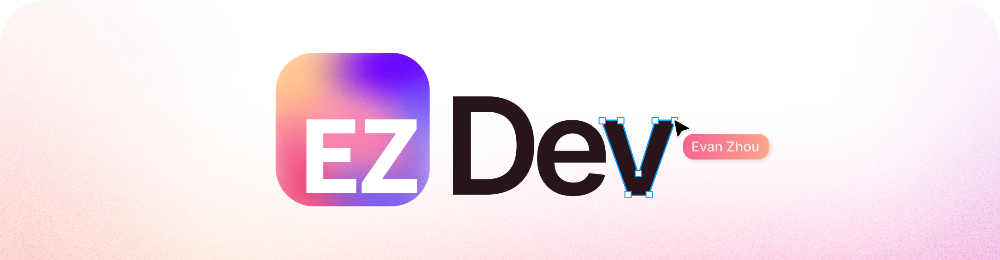

> 🏗️ Work in Progress!

## My Design Philosphy

<table>
  <tr>
    <td valign="top" align="left" width="33%">
      
      
Know exactly what you are making and why. If you cannot give a clear <i>definition</i> of your product, that product shouldn’t exist.

      
    </td>
    <td valign="top" align="left" width="33%">
      
      
A product is designed for its users. The <i>implementation</i> should not only be functional, but intuitive and enjoyable to use.

      
    </td>
    <td valign="top" align="left" width="33%">
      
      
Even the best product can be overlooked if presented in a careless manner. Present your product in a creative and professional to <i>impute</i> those qualities.

      
    </td>
  </tr>
</table>

_Inspired by The Apple Marketing Philosphy (1977)_

## ✨ Skills

> What can I do?

### General

- Web devlopment
  - React/JSX
  - Next.js Framework
  - Redux
- Web Scraping
  - Headless browser control with [Puppeteer](https://pptr.dev/)
  - Getting general information with [Axios](https://axios-http.com/)
- UI/Graphic Design
  - CSS/HTML

### Fluent Languages

- Javascript/JSX
- Python
- English

### JavaScript Specific Toolset

- NodeJS
- NPM
- HTML5 Canvas

## 👾 Software

> What's on my computer?

- IDE: [VSCode](https://code.visualstudio.com/)
- Design Software: [Figma](https://figma.com)
- Browser: [Arc](https://arc.net/)
- Keyboard Customizer: [Karabiner Elements](https://karabiner-elements.pqrs.org/)

Other Productivity Tools:

- Spotlight Search Alternative: [Raycast](https://www.raycast.com/)
  - Proud [Raycast Pro](https://www.raycast.com/pro) Subscriber!
- Screenshots: [Shottr](https://shottr.cc/)

## 💻 Hardware

> What do I use?

- Computer: M1 Macbook Air
- Keyboard: Keychron K2 w/ Gateron Brown switches
- Mouse: Logi MX 2 Anywhere
- Stand: Rain Design mStand

## 📈 Stats

> How much do I do what I do?

