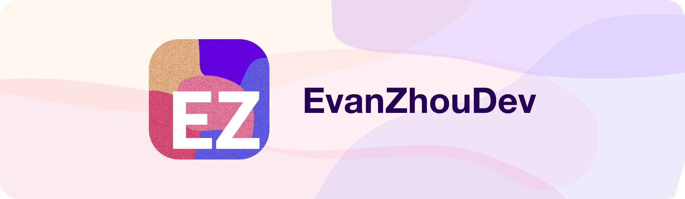

    

Hello! I'm Evan Zhou, a designer and web developer. I love new technologies, and are constantly looking for something interesting to play around with. If you've got something, let me know!

## ✨ Skills

> What can I do?

### General

- Web devlopment
  - React/JSX
  - Next.js Framework
  - Redux
- Web Scraping
  - Headless browser control with [Puppeteer](https://pptr.dev/)
  - Getting general information with [Axios](https://axios-http.com/)
- UI/Graphic Design
  - CSS/HTML

### Fluent Languages

- Javascript/JSX
- Python
- English

### JavaScript Specific Toolset

- NodeJS
- NPM
- HTML5 Canvas

## 👾 Software
> What's on my computer?

- IDE: [VSCode](https://code.visualstudio.com/)
- Design Software: [Figma](https://figma.com)
- Browser: [Arc](https://arc.net/)
- Keyboard Customizer: [Karabiner Elements](https://karabiner-elements.pqrs.org/)

Other Productivity Tools:

- Spotlight Search Alternative: [Raycast](https://www.raycast.com/)
- Screenshots: [Shottr](https://shottr.cc/)

## 💻 Hardware

> What do I use?

- Computer: M1 Macbook Air
- Keyboard: Keychron K2 w/ Gateron Brown switches
- Mouse: Logi MX 2 Anywhere
- Stand: Rain Design mStand
