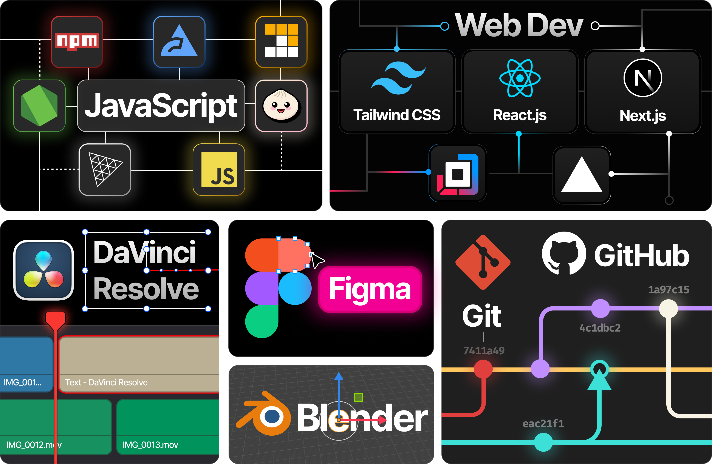

<picture>
  <source media="(prefers-color-scheme: dark)" srcset="./banner/ezdevBannerDark.png">
  
</picture>

> _"The people who are crazy enough to think they can change the world are the ones who do."_ \- Steve Jobs

Designer, Developer, Content Creator. Building the future, one line of code at a time.

## What Do I Do?

## My Design Philosphy

> _"People don't know what they want until you show it to them."_ \- Steve Jobs

<table>
  <tr>
    <td valign="top" align="left" width="33%">
      <picture>
        <source media="(prefers-color-scheme: dark)" srcset="./designPhilosophyHeaders/define_dark.png">
        
      </picture>
      
Know exactly what you are making and why. If you cannot give a clear <i>definition</i> of your product, that product shouldn’t exist.

    </td>
    <td valign="top" align="left" width="33%">
      <picture>
        <source media="(prefers-color-scheme: dark)" srcset="./designPhilosophyHeaders/implement_dark.png">
        
      </picture>
      
A product is designed for its users. The <i>implementation</i> should not only be functional, but intuitive and enjoyable to use.

    </td>
    <td valign="top" align="left" width="33%">
      <picture>
        <source media="(prefers-color-scheme: dark)" srcset="./designPhilosophyHeaders/impute_dark.png">
        
      </picture>
      
Even the best product can be overlooked if presented in a careless manner. Present your product in a creative and professional to <i>impute</i> those qualities.

    </td>
  </tr>
</table>

_Inspired by [The Apple Marketing Philosophy (1977)](https://www.customerengagementinsider.com/digital-strategy/articles/what-we-can-learn-apple-marketing-philosophy)_

## Skills

#### General Skills

- Programming for 8 years
- Fluent in Javascript and Python, experience in Java, Swift, and more
- Experienced in Git and GitHub
- Extensive Artificial Intelligence API design experience

#### JS Development

- Over 6 years of JS dev experience
- Worked with both [Node](https://nodejs.org/en) and [Bun](https://bun.sh/) runtimes
- NPM packages published with over [100,000 downloads](https://npm-stat.com/charts.html?author=evanzhoudev&from=2020-01-01)
- Worked with numerous libraries including [Puppeteer](https://pptr.dev/), [Jest](https://jestjs.io/), [Vitest](https://vitest.dev/), and more

#### Web Development

- Fluent in [React](https://vitest.dev/) and JSX
- Extensively worked with [Next.js](https://nextjs.org/) framework
- Worked with CSS libraries including [styled-components](https://styled-components.com/) and [Tailwind](https://tailwindcss.com/)
- Experience in popular libraries and frameworks like [Daisy UI](https://daisyui.com/), [React Redux](https://react-redux.js.org/), [useHooks](https://usehooks.com/), and more

#### Design and Content Creation

- Over 4 years of design and 5 years of content creation experience
- Prototyping and Design with [Figma](https://www.figma.com/)
- Editing and Animating with [DaVinci Resolve](https://www.blackmagicdesign.com/products/davinciresolve)
- 3D Modeling with [Blender](https://www.blender.org/)

## What's on my Computer?

- Browser: [Arc](https://arc.net/)
- Screenshots: [Shottr](https://shottr.cc/)
- App Launcher: [Raycast](https://www.raycast.com/)
- Keyboard Customizer: [Karabiner Elements](https://karabiner-elements.pqrs.org/)

#### Development

- IDE: [VSCode](https://code.visualstudio.com/) with [One Dark Pro theme](https://marketplace.visualstudio.com/items?itemName=zhuangtongfa.Material-theme)
- Terminal: [iTerm2](https://iterm2.com/) with Hotkey Window

#### Hyperkey

My `Caps Lock` key is set to `Hyperkey` (⇧⌘⌥^) to act as an additional modifier. In combination with Raycast, iTerm, and system actions, it's a powerful addition to my keyboard. Here are some of my favorite actions:

| Shortcut        | Action                                   |
| --------------- | ---------------------------------------- |
| Hyper + `I`     | Open iTerm with Hotkey _(iTerm)_         |
| Hyper + `D`     | Define Word _(Raycast)_                  |
| Hyper + `T`     | Translate _(Raycast)_                    |
| Hyper + `Space` | Search Emojis _(Raycast)_                |
| Hyper + `Enter` | Open Raycast AI Chat _(Raycast)_         |
| Hyper + `A`     | Apple Intelligence Siri Hotkey _(MacOS)_ |

  
More Actions

| Shortcut    | Action                                                         |
| ----------- | -------------------------------------------------------------- |
| Hyper + `←` | Resize window to Left Half _(Raycast)_                         |
| Hyper + `→` | Resize window to Right Half _(Raycast)_                        |
| Hyper + `↑` | Maximize window to Upmost scale _(Raycast)_                    |
| Hyper + `↓` | Fullscreen Active App _(Raycast)_                              |
| Hyper + `C` | Browse Coding Projects _(Raycast)_                             |
| Hyper + `P` | Remaps to ^P _(Karabiner Elements)_                            |
| Hyper + `N` | Remaps to ^N _(Karabiner Elements)_                            |
| Hyper + `L` | Locate Files with File Search _(Raycast)_                      |
| Hyper + `[` | Create Reminder _(Raycast)_                                    |
| Hyper + `]` | Browser Reminders _(Raycast)_                                  |
| Hyper + `3` | Screenshot Screen and copy to Clipboard _(Mac Screenshot App)_ |
| Hyper + `4` | Screenshot Area and copy to Clipboard _(Mac Screenshot App)_   |
| Hyper + `S` | Scrolling Screenshot _(Shottr)_                                |
| Hyper + `O` | OCR Capture _(Shottr)_                                         |

## Stats

